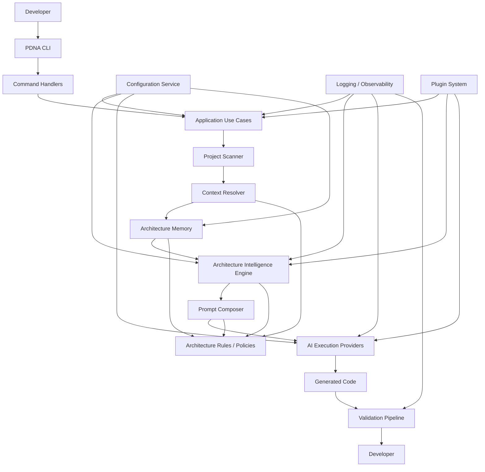

# Project DNA Architecture Evolution Plan

## Executive Summary

The current implementation is a valid prototype scaffold, but it needs a disciplined hardening iteration before it can become the foundation of a production-grade AI Architecture Governance Platform. The architecture should evolve incrementally rather than be rewritten.

The most important correction is conceptual:

- Fireworks is not an AI code generation provider.
- Fireworks is the internal Architecture Intelligence Engine.
- Claude CLI, Codex CLI, and Gemini CLI are execution providers that generate code.
- Project DNA sits between the developer and those providers and provides architectural reasoning, context, prompts, and validation.

This plan preserves the current codebase and improves it through layered evolution.

---

## 1. Updated Architecture Diagram



### Architectural interpretation

The flow is no longer “CLI → core service → file output.”
It becomes:

Developer → CLI → Application Use Case → Scanner → Context Resolver → Memory → Intelligence Engine → Prompt Composer → Execution Provider → Validation → Developer.

This makes the system much easier to evolve into a real governance platform.

---

## 2. Layer Responsibilities

### 2.1 Presentation Layer

Responsibilities:
- Expose command-line interface commands
- Parse arguments and options
- Format output to users
- Delegate to application use cases

Current modules to evolve:
- src/cli/program.ts
- src/commands/init.ts
- src/commands/ask.ts
- src/commands/validate.ts

Responsibilities that should remain here:
- Command parsing
- Human-friendly output
- Input validation at the surface level

Responsibilities that must not live here:
- Architectural reasoning
- Prompt composition
- Provider execution
- Storage logic
- Validation logic

### 2.2 Application Layer

Responsibilities:
- Coordinate use cases
- Orchestrate subsystem interactions
- Apply business rules at an application level
- Manage workflows and transactions
- Encapsulate use-case behavior

New modules to introduce:
- src/application/init-project.use-case.ts
- src/application/resolve-context.use-case.ts
- src/application/compose-prompt.use-case.ts
- src/application/validate-output.use-case.ts
- src/application/run-architecture-intelligence.use-case.ts

This layer becomes the primary orchestration boundary between CLI and infra.

### 2.3 Domain Layer

Responsibilities:
- Define platform concepts and business entities
- Hold architecture knowledge models
- Represent project structure and architectural decisions
- Contain rules that are independent of frameworks

New modules to introduce:
- src/domain/project-context.ts
- src/domain/architecture-snapshot.ts
- src/domain/architecture-insight.ts
- src/domain/prompt-package.ts
- src/domain/validation-result.ts
- src/domain/provider-response.ts

These models should be strongly typed, framework-agnostic, and stable.

### 2.4 Infrastructure Layer

Responsibilities:
- Implement persistence, scanning, provider execution, and filesystem interaction
- Hide technical details behind interfaces
- Provide adapters to concrete technologies

Existing modules to evolve:
- src/utils/files.ts
- src/memory/memory-service.ts

New modules to introduce:
- src/infrastructure/scanners/project-scanner.ts
- src/infrastructure/repositories/file-memory-repository.ts
- src/infrastructure/providers/claude-provider.ts
- src/infrastructure/providers/codex-provider.ts
- src/infrastructure/providers/gemini-provider.ts
- src/infrastructure/validators/validator-pipeline.ts
- src/infrastructure/logging/logger.ts
- src/infrastructure/config/environment-config.ts

### 2.5 Shared Services Layer

Responsibilities:
- Configuration
- Logging
- Errors
- Eventing
- Plugin registry
- Observability hooks

New modules to introduce:
- src/shared/configuration.service.ts
- src/shared/error-handler.ts
- src/shared/telemetry.ts
- src/shared/events.ts

---

## 3. New Modules to Introduce

### 3.1 Project Scanner

Purpose:
- Understand the project structure
- Read files such as package.json, tsconfig.json, and framework config
- Discover dependencies and high-level architecture patterns
- Produce structured metadata without making decisions

Proposed module:
- src/infrastructure/scanners/project-scanner.ts

Responsibilities:
- Read package manifests
- Extract technology stack information
- Discover source folders
- Identify framework patterns
- Collect project metadata for later resolution

Important constraint:
- It should not infer architectural decisions or prescribe architecture rules.

### 3.2 Context Resolver

Purpose:
- Convert raw scanner output into normalized architectural context
- Organize metadata into a stable shape for memory and reasoning

Proposed module:
- src/application/context-resolver.ts

Responsibilities:
- Normalize discovered data
- Enrich with defaults
- Group related information by concern
- Produce a structured context object for later layers

Important constraint:
- It should not perform architectural reasoning or prompt generation.

### 3.3 Architecture Memory

Purpose:
- Persist architectural knowledge and project history
- Provide a repository abstraction for snapshots, rules, and memory records

Existing module to evolve:
- src/memory/memory-service.ts

Proposed abstraction:
- src/domain/ports/memory-repository.ts
- src/infrastructure/repositories/file-memory-repository.ts

Responsibilities:
- Store architecture snapshots
- Record project context versions
- Support future SQLite/vector/cloud storage

Important constraint:
- It stores knowledge; it does not generate it.

### 3.4 Architecture Intelligence Engine

Purpose:
- Interpret architectural context and produce structured intelligence output
- Serve as the internal reasoning engine powered by Fireworks

Proposed modules:
- src/domain/ports/architecture-intelligence.ts
- src/infrastructure/intelligence/fireworks-engine.ts

Responsibilities:
- Understand architecture relationships
- Interpret context and missing context
- Select relevant architectural memory
- Prepare structured guidance for prompt composition

Important constraint:
- It must not generate implementation code.
- It should return structured architectural guidance data.

### 3.5 Prompt Composer

Purpose:
- Build the final prompt package for execution providers

Proposed module:
- src/application/prompt-composer.ts

Responsibilities:
- Merge developer request with context, memory, rules, and policies
- Produce a structured package suitable for providers
- Add guardrails and instruction sets

Important constraint:
- It should not decide architecture; it should package it.

### 3.6 AI Providers

Purpose:
- Execute the final prompt package using an external coding assistant

Proposed modules:
- src/domain/ports/execution-provider.ts
- src/infrastructure/providers/claude-provider.ts
- src/infrastructure/providers/codex-provider.ts
- src/infrastructure/providers/gemini-provider.ts

Responsibilities:
- Receive prompt packages
- Execute external providers
- Return generated results

Important constraint:
- Providers do not reason about architecture.

### 3.7 Validation Pipeline

Purpose:
- Validate generated output against architecture rules and project constraints

Proposed modules:
- src/domain/ports/validator.ts
- src/infrastructure/validators/validator-pipeline.ts

Responsibilities:
- Apply structural checks
- Enforce rules
- Return validation results

### 3.8 Configuration Service

Purpose:
- Provide typed configuration for providers, storage, plugins, and runtime

Proposed module:
- src/shared/configuration.service.ts

Responsibilities:
- Load .env values
- Provide defaults
- Validate configuration using Zod or equivalent

### 3.9 Structured Error Handling

Purpose:
- Provide typed errors and safe failure boundaries

Proposed module:
- src/shared/errors.ts

Responsibilities:
- Classify failures
- Standardize messages
- Preserve actionable diagnostics

### 3.10 Observability Layer

Purpose:
- Support logging, tracing, and future analytics

Proposed module:
- src/shared/telemetry.ts

Responsibilities:
- Emit logs and events
- Record request lifecycle events
- Support future dashboards and metrics

### 3.11 Plugin Architecture

Purpose:
- Allow future extension points without hard-coding capabilities

Proposed module:
- src/plugins/plugin-manager.ts

Responsibilities:
- Discover plugins
- Register hooks
- Manage lifecycle

---

## 4. Interfaces to Create

### 4.1 Project Scanner Port

```ts
interface ProjectScanner {
  scan(projectRoot: string): Promise<ProjectScanResult>;
}
```

### 4.2 Context Resolver Port

```ts
interface ContextResolver {
  resolve(scanResult: ProjectScanResult): Promise<ResolvedContext>;
}
```

### 4.3 Memory Repository Port

```ts
interface MemoryRepository {
  saveSnapshot(snapshot: ArchitectureSnapshot): Promise<void>;
  loadLatest(projectId: string): Promise<ArchitectureSnapshot | null>;
  listHistory(projectId: string): Promise<ArchitectureSnapshot[]>;
}
```

### 4.4 Architecture Intelligence Port

```ts
interface ArchitectureIntelligenceEngine {
  reason(context: ResolvedContext, memory: ArchitectureSnapshot | null): Promise<ArchitectureInsight>;
}
```

### 4.5 Prompt Composer Port

```ts
interface PromptComposer {
  compose(request: PromptRequest): Promise<PromptPackage>;
}
```

### 4.6 Execution Provider Port

```ts
interface ExecutionProvider {
  execute(prompt: PromptPackage): Promise<ExecutionResult>;
}
```

### 4.7 Validator Port

```ts
interface Validator {
  validate(output: ExecutionResult, context: ResolvedContext): Promise<ValidationResult>;
}
```

### 4.8 Configuration Port

```ts
interface ConfigurationService {
  get<T>(key: string, fallback?: T): T;
}
```

### 4.9 Plugin Port

```ts
interface Plugin {
  name: string;
  register(registry: PluginRegistry): void;
}
```

---

## 5. Dependency Rules

The architecture should enforce these rules:

### Allowed dependencies

- CLI → Application use cases
- Commands → Application use cases
- Application → Domain + Ports + Shared services
- Use cases → Repositories, scanners, providers, validators, configuration
- Infrastructure → Domain interfaces and concrete technical dependencies
- Shared services → Domain-neutral utilities only

### Forbidden dependencies

- Infrastructure should not depend on CLI concerns
- Domain should not depend on infrastructure implementations
- Providers should not perform architectural reasoning
- Fireworks engine should not directly execute code generation
- Prompt composer should not depend on concrete provider implementations
- Validators should not depend on presentation concerns

### Dependency injection rule

Concrete implementations should be registered at composition root time, not created directly inside use cases.

The current approach of instantiating services directly inside commands should be replaced gradually with dependency injection.

---

## 6. Data Flow from CLI to AI Provider

### Current state

Developer → CLI → Core Service → Filesystem → Response

### Target state

Developer → CLI → Command Handler → Application Use Case → Project Scanner → Context Resolver → Memory Repository → Architecture Intelligence Engine → Prompt Composer → Execution Provider → Generated Output → Validation Pipeline → Developer

This creates a much more realistic development lifecycle and makes the architecture future-proof.

---

## 7. Data Flow Inside the Architecture Intelligence Engine

The Architecture Intelligence Engine should operate as a structured pipeline:

1. Receive resolved architectural context
2. Load relevant memory snapshots
3. Analyze architecture relationships
4. Identify missing or ambiguous context
5. Infer architectural intent and constraints
6. Produce structured guidance for prompt composition

Example output:

```json
{
  "summary": "Service-oriented architecture with layered responsibilities",
  "keyConstraints": ["Preserve CLI behavior", "Avoid provider coupling"],
  "missingContext": ["Team conventions"],
  "recommendedPromptFocus": ["Architecture preservation", "Validation rules"],
  "riskAreas": ["Over-coupling in core orchestration"]
}
```

This output should be consumed by the Prompt Composer, not by the external coding assistant directly.

---

## 8. Interaction Between Fireworks and External Coding Assistants

Fireworks should be treated as an internal reasoning layer.

### Responsibilities of Fireworks

- Understand project architecture
- Interpret project context
- Recommend architectural instructions
- Return structured guidance
- Identify missing context

### Responsibilities of Claude/Codex/Gemini

- Receive the final prompt package
- Generate implementation code
- Execute the developer request

### Key rule

Fireworks and execution providers are not interchangeable.
They are different layers in the system.

This distinction should be reflected in the architecture and module naming.

---

## 9. Future Extensibility Strategy

The architecture should support expansion without forcing rewrites.

### Strategy

1. Keep domain concepts stable
2. Use ports and adapters for integrations
3. Keep the application layer as the primary orchestration boundary
4. Introduce plugin hooks for extensions
5. Keep the storage layer abstracted for future backends
6. Keep the intelligence engine replaceable behind an interface

### Why this matters

This prevents the current product from becoming a monolith of tightly-coupled logic as providers, memory backends, validation styles, and team collaboration features grow.

---

## 10. Incremental Implementation Order

The implementation should be phased to avoid major rewrites and reduce risk.

### Phase 1 — Harden the existing foundation

Goal:
- Keep current functionality intact while improving structure

Actions:
- Introduce a configuration service
- Introduce a structured error model
- Introduce a logging abstraction
- Move direct service instantiation behind a simple dependency container
- Keep current CLI commands working without breaking behavior

Why first:
- These are low-risk, high-leverage improvements that prepare the codebase for future growth.

### Phase 2 — Introduce domain models

Goal:
- Replace raw JSON-like data passing with typed domain entities

Actions:
- Create project context, architecture snapshot, prompt package, and validation result models
- Update the existing memory and core services to use them

Why second:
- Strong typing makes the system much easier to evolve safely.

### Phase 3 — Introduce repository abstraction for memory

Goal:
- Make memory storage pluggable

Actions:
- Create a MemoryRepository interface
- Move the current JSON file persistence behind a FileMemoryRepository adapter
- Keep the same external behavior

Why third:
- Memory is central to the platform’s value.

### Phase 4 — Introduce Project Scanner

Goal:
- Replace manual metadata assumptions with real project introspection

Actions:
- Add a scanner that reads package.json, tsconfig.json, and source files
- Produce a normalized scan result object

Why fourth:
- The scanner becomes the foundation for context resolution and intelligence.

### Phase 5 — Introduce Context Resolver

Goal:
- Convert raw scan output into structured architecture context

Actions:
- Introduce a resolver that organizes context into a stable schema

Why fifth:
- This is the step that turns raw project discovery into usable architectural context.

### Phase 6 — Introduce Architecture Intelligence Engine

Goal:
- Add the internal reasoning engine powered by Fireworks

Actions:
- Introduce an engine interface
- Implement a first adapter for Fireworks
- Ensure its output is structured and not code generation output

Why sixth:
- This is the core distinction of the platform.

### Phase 7 — Introduce Prompt Composer

Goal:
- Combine memory, context, and intelligence into a provider-ready package

Actions:
- Build the prompt package structure
- Tie it to execution providers

Why seventh:
- Prompts should be composed before execution, not ad hoc inside providers.

### Phase 8 — Introduce execution provider abstraction

Goal:
- Support Claude, Codex, Gemini through a common interface

Actions:
- Create provider adapter interface
- Implement first provider adapters

Why eighth:
- This enables multiple execution paths without coupling the architecture to one AI backend.

### Phase 9 — Introduce validation pipeline

Goal:
- Ensure generated output aligns with architectural rules

Actions:
- Introduce validator interfaces and a pipeline executor
- Add first validation checks

Why ninth:
- Validation is essential for governance.

### Phase 10 — Introduce plugin architecture and future extensibility hooks

Goal:
- Keep the platform extendable without direct coupling

Actions:
- Introduce a plugin registry and lifecycle hooks

Why tenth:
- This prevents future hard-coded expansion.

### Phase 11 — Add MCP and dashboard surfaces

Goal:
- Expose the same core application to richer environments

Actions:
- Connect application use cases to MCP and API/dashboard layers

Why eleventh:
- These are best implemented once the core architecture is stable.

---

## Recommended Evolution of Existing Files

### Existing files that should evolve

#### src/cli/program.ts

Should evolve from a direct command wrapper into a thin presentation layer that dispatches to application use cases.

#### src/commands/init.ts

Should become a thin adapter around an initialization use case.

#### src/core/project-dna-service.ts

Should be split into use cases and orchestration services rather than remaining a single mono-service.

#### src/memory/memory-service.ts

Should become an adapter or repository implementation behind a stable memory interface.

#### src/utils/files.ts

Should remain as a low-level utility, but its usage should be encapsulated in infrastructure modules.

#### src/types/index.ts

Should evolve into domain models rather than a loose collection of simple interfaces.

### Existing files that should remain

- src/utils/logger.ts as a basic logging utility
- package.json as the package manifest
- tsconfig.json and tsup.config.ts for build correctness

---

## What Should Not Be Done

To preserve the current architecture and avoid a rewrite:

- Do not replace the current CLI structure immediately
- Do not remove the current command modules
- Do not replace the current memory service wholesale in one step
- Do not introduce over-engineered abstractions before the domain is understood
- Do not create a separate Fireworks provider abstraction that confuses Fireworks with execution providers

Instead:

- Wrap existing services with interfaces
- Introduce use cases incrementally
- Keep the current command surface stable
- Add adapters around the existing implementation rather than replacing it in one shot

---

## Final Recommendation

The architecture should evolve in a pragmatic, layered way:

1. Preserve the current CLI and command structure.
2. Introduce application use cases and domain models.
3. Introduce ports and adapters for memory and providers.
4. Add scanner, resolver, memory, intelligence, prompt composer, provider, and validation layers.
5. Keep Fireworks inside the intelligence layer and providers as execution-only adapters.
6. Use dependency injection and shared services to keep the design maintainable.

This will preserve backward compatibility while allowing Project DNA to grow into the platform it was designed to become.
