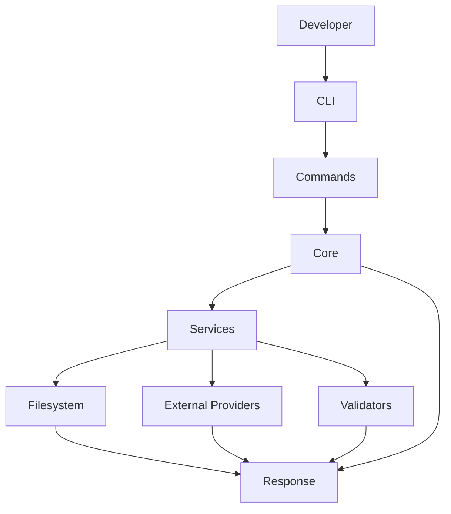

# Project DNA Pre-Production Architecture Review

## Executive Summary

The current implementation is a solid starter scaffold, but it is not yet a production-grade foundation for a long-term AI architecture governance platform. It is a good first step for proving the command surface and basic file-based memory creation, but it does not yet embody the architectural discipline required to scale into a multi-provider, plugin-driven, enterprise platform.

In its current form, Project DNA can support the initial CLI skeleton and basic initialization flow. It cannot yet evolve cleanly into architecture memory, context resolution, provider abstraction, validation pipelines, plugin management, or an enterprise dashboard without accumulating significant technical debt and forcing a later rewrite.

The biggest issue is not that the code is “bad.” The biggest issue is that the architecture is still too procedural and too coupled to the current CLI use case. It lacks the abstractions needed to support multiple providers, pluggable intelligence, domain modeling, and long-term persistence.

## Brutal Assessment

### What is good

- Clear separation between CLI and core logic
- A small, understandable module structure
- A memory-oriented initialization flow
- A simple path to add more commands later
- Strong enough foundation for a v0 prototype

### What is weak

- The architecture is too thin to support the platform vision
- The core layer currently acts as an application service plus orchestration layer, which is a design smell
- Memory is implemented as a file-writing service rather than a proper repository abstraction
- There is no interface-driven boundary for providers, validators, or context sources
- There is no domain model or typed architecture graph
- There is no configuration or environment abstraction
- There is no plugin lifecycle
- There is no observability, tracing, or error model
- The CLI is currently the main entrypoint for the application, but the real system should be built around use cases and ports

## Major Weaknesses

| Weakness | Why it is a problem | Impact as it grows | Better solution | Fix now or later |
| --- | --- | --- | --- | --- |
| No dependency inversion | The core service creates concrete dependencies directly | Hard to support multiple providers and repositories | Introduce interfaces and dependency injection containers or simple registries | Fix now |
| Memory is file-oriented and not abstracted | The memory layer is tightly coupled to filesystem details and JSON serialization | Will become brittle as memory grows into graph-based or vector-based storage | Define a MemoryRepository port and implement file, sqlite, or remote adapters | Fix now |
| No domain model | Architecture data is handled as raw JSON and strings | Hard to reason about architectural relationships and validation rules | Introduce domain entities such as ProjectContext, ArchitectureNode, DependencyRecord, and ValidationResult | Fix now |
| CLI layer contains business-facing orchestration | The CLI is currently responsible for translating commands into service actions, but the core layer is still too procedural | The system will become harder to reuse from SDK or MCP contexts | Move to application use cases that are invoked by CLI, API, and MCP layers | Fix now |
| No provider abstraction | Providers would be implemented directly inside core logic later | Multi-provider support will become a rewrite | Define a ProviderPort and ProviderRegistry with versioned capabilities | Fix now |
| No validation pipeline abstraction | Validation logic is not modeled as a composable pipeline | Response validation and architectural checks will become monolithic | Create a Validator interface and chain validators through a pipeline | Fix now |
| No configuration and environment model | The platform will eventually need secrets, providers, plugins, storage backends, and runtime settings | Configuration will become scattered and error-prone | Introduce a typed configuration service with environment sourcing and profiles | Fix now |
| No error handling strategy | Errors are surfaced as string messages | Production experience will be poor, and debugging will be hard | Introduce typed errors, result types, logging, and structured diagnostics | Fix now |
| No observability | No tracing, telemetry, or metrics | Hard to debug provider calls, prompt composition, and validation failures | Add structured logging, request correlation, and metrics hooks | Fix now |
| No plugin lifecycle | Future plugins would be bolted on later | Plugin management will become unstable and invasive | Introduce plugin contracts, lifecycle hooks, manifests, and sandbox boundaries | Later, but design for it now |
| No async orchestration model | The system is still effectively synchronous | Will struggle with multiple providers and asynchronous context assembly | Introduce a workflow engine or task runner abstraction | Later |
| No persistence strategy for growth | Current JSON files are fine for v0, but not for large-scale memory | The memory layer becomes a bottleneck | Introduce a layered storage strategy: local cache, sqlite, vector store, remote sync | Later |

## Detailed Layer-by-Layer Architecture Review

### 1. CLI Layer

#### Current modules

- src/cli/program.ts
- src/commands/init.ts
- src/commands/ask.ts
- src/commands/validate.ts

#### Why it exists

It exposes the command-line interface for the package.

#### Ownership

Owned by the presentation layer.

#### Allowed to use it

- Commands may use application services
- Commands should not use repositories or infrastructure directly

#### Must never depend on it

- Domain entities
- Infrastructure services
- Memory storage implementations

#### Future responsibilities

- Support subcommands for architecture, memory, provider, plugin, and dashboard operations
- Provide consistent CLI UX and output formatting
- Delegate to application use cases only

#### Architectural concern

The current command layer is acceptable for v0, but it should not become the place where business logic resides. Right now it is still thin, which is good, but the eventual system should have an application layer that the CLI and MCP server both invoke.

### 2. Command Layer

#### Current modules

- src/commands/*.ts

#### Why it exists

To translate CLI commands into core operations.

#### Ownership

Presentation/application boundary.

#### Allowed to use it

- Application services and orchestrators only

#### Must never depend on it

- Repositories directly
- AI provider clients directly

#### Future responsibilities

- Support command aliases, batched execution, scan modes, and dry-run modes

#### Architectural concern

This layer is still too close to the CLI implementation. It should evolve into thin adapters over application use cases.

### 3. Core Layer

#### Current modules

- src/core/project-dna-service.ts

#### Why it exists

It is the first business-logic boundary.

#### Ownership

Application layer.

#### Allowed to use it

- Memory, context, provider, validator, and utility services

#### Must never depend on it

- The UI/CLI presentation layer should not depend on core internals in a way that creates an inversion problem
- It should not know about concrete file system or provider implementations

#### Future responsibilities

- Be the orchestration layer for initialization, context retrieval, prompt assembly, validation, plugin hooks, and dashboard updates

#### Architectural concern

The current ProjectDnaService is too broad and too concrete. It should evolve into a façade over use cases and domain services.

### 4. Memory Layer

#### Current modules

- src/memory/memory-service.ts

#### Why it exists

To initialize and persist architectural memory files.

#### Ownership

Infrastructure/application boundary.

#### Allowed to use it

- Application services

#### Must never depend on it

- Providers or prompt composers should not depend on concrete memory service implementations directly

#### Future responsibilities

- Manage architecture snapshots, project history, incremental changes, embeddings, graph relationships, and synchronization

#### Architectural concern

The current implementation is a simple file writer and should be promoted to a repository abstraction with ports and adapters.

### 5. Context Layer

#### Current modules

- src/context/

#### Why it exists

To hold project context and provide structured decision support.

#### Ownership

Domain/application boundary.

#### Allowed to use it

- Prompt composers, validators, and memory services

#### Must never depend on it

- CLI presentation layer

#### Future responsibilities

- Gather project metadata, dependency graphs, architecture summaries, coding conventions, team preferences, and domain context

#### Architectural concern

This layer is currently conceptual and not yet implemented. It must be treated as a first-class subsystem, not an afterthought.

### 6. Providers Layer

#### Current modules

- src/providers/

#### Why it exists

To host provider integrations.

#### Ownership

Infrastructure/external integration boundary.

#### Allowed to use it

- Application orchestration services

#### Must never depend on it

- Domain models should not depend directly on provider implementations

#### Future responsibilities

- Provide multiple AI backends, model discovery, capability negotiation, and provider-specific configuration

#### Architectural concern

This layer exists only as a placeholder and should be defined with contracts immediately, not later.

### 7. Validators Layer

#### Current modules

- src/validators/

#### Why it exists

To enforce architectural quality.

#### Ownership

Domain/application boundary.

#### Allowed to use it

- Prompt composers, context assembly, and response orchestration

#### Must never depend on it

- Domain models should not depend on validator implementations directly

#### Future responsibilities

- Validate generated responses, conformance to architecture rules, schema constraints, and policy compliance

#### Architectural concern

This layer is currently not implemented in a way that can evolve into a pipeline.

### 8. Utilities Layer

#### Current modules

- src/utils/logger.ts
- src/utils/files.ts

#### Why it exists

To provide low-level supporting capabilities.

#### Ownership

Shared infrastructure.

#### Allowed to use it

- All layers, but only as a dependency of last resort

#### Must never depend on it

- Domain logic cannot depend on utility layers in a way that hides architectural concerns

#### Future responsibilities

- Logging, config parsing, serialization, file operations, time helpers, hashing, and diagnostics

#### Architectural concern

This is fine, but utilities should not become a dumping ground for cross-cutting logic that belongs in shared infrastructure services.

## Dependency Flow Diagram

## Extensibility, Maintainability, and Future Growth

### Current strengths

- The structure is simple enough to reason about
- The package can be extended later without rewriting the whole app
- Separation between CLI and core logic is directionally correct

### Current limitations

- There is no explicit architecture boundary between application use cases and infrastructure concerns
- There is no interface-driven extension point for providers, memory, or validators
- The system is not yet extensible in a way that will remain stable as the product grows

### Verdict

The current architecture is suitable for a prototype, but not yet for a platform that needs to support multiple AI providers, plugins, enterprise integrations, and long-term memory. It should be treated as a foundation layer that will need a significant architectural hardening pass before the next major feature set.

## Recommended 12-Month Roadmap

### Phase 1: Harden the foundation (0-2 months)

#### Goal

Turn the scaffold into a stable application architecture.

#### Implement

- Introduce typed configuration
- Introduce domain models
- Introduce use cases and interfaces
- Introduce a repository abstraction for memory
- Introduce structured error handling and logging

#### Reuse existing modules

- CLI layer
- Core service shell
- Memory service
- Logger and file utilities

#### New modules

- src/domain/
- src/application/
- src/infrastructure/
- src/config/
- src/errors/
- src/ports/

#### Interfaces to create

- MemoryRepository
- ContextProvider
- ProviderAdapter
- Validator
- CommandHandler
- ConfigLoader

#### Refactor needed

Yes. The current service should be split into application use cases and infrastructure adapters.

### Phase 2: Architecture Memory (2-4 months)

#### Why now

Without memory, the product has no unique value beyond a thin wrapper.

#### Reuse

- Memory service
- File utilities
- CLI commands

#### New modules

- ArchitectureGraph
- MemorySnapshot
- ProjectSnapshotStore
- MemoryIndexService

#### Interfaces

- MemoryRepository
- SnapshotStore
- MemoryIndexer

#### Refactor

Yes. Replace simple JSON writing with a repository abstraction and snapshot versioning.

### Phase 3: Context Resolver (3-5 months)

#### Why now

Context assembly is central to the promise of Project DNA.

#### Reuse

- Memory layer
- Core orchestration

#### New modules

- ContextResolver
- ContextAssembler
- ProjectScanner
- RuleCollector

#### Interfaces

- ContextSource
- ContextResolverStrategy

#### Refactor

Yes. Current core service should delegate to a context resolver instead of assembling everything inline.

### Phase 4: Prompt Composer (4-6 months)

#### Why now

Prompt composition is where project-specific context becomes useful to AI agents.

#### Reuse

- Context resolver
- Memory repository
- Providers layer

#### New modules

- PromptComposer
- PromptTemplateRegistry
- PromptContextBuilder

#### Interfaces

- PromptTemplateProvider
- PromptRenderer

#### Refactor

Yes. Avoid embedding prompt logic inside the core service.

### Phase 5: AI Provider Abstraction (5-7 months)

#### Why now

The platform should not be tied to one AI vendor.

#### Reuse

- Core orchestration
- Prompt composer

#### New modules

- ProviderRegistry
- ProviderAdapter
- CapabilityDescriptor
- ProviderConfig

#### Interfaces

- ProviderAdapter
- ProviderCapability

#### Refactor

Yes. This is an architectural priority, not an implementation detail.

### Phase 6: Validation Pipeline (6-8 months)

#### Why now

The platform must validate outputs against architecture rules.

#### Reuse

- Core orchestration
- Prompt composer
- Memory layer

#### New modules

- ValidationEngine
- RuleCatalog
- ValidationResult
- ArchitectureGuard

#### Interfaces

- Validator
- ValidationRule

#### Refactor

Yes. The current placeholder validates nothing and should become a formal pipeline.

### Phase 7: Plugin System (7-9 months)

#### Why now

The platform will need pluggable capabilities for teams and integrations.

#### Reuse

- Provider abstraction
- Validation pipeline
- Memory layer

#### New modules

- PluginManager
- PluginRegistry
- PluginManifest
- PluginRuntime

#### Interfaces

- Plugin
- PluginHook

#### Refactor

Yes. Design this from the start as a first-class extension mechanism rather than an ad hoc feature.

### Phase 8: MCP Server (8-10 months)

#### Why now

An MCP server would make Project DNA usable by AI coding assistants and other tools.

#### Reuse

- Application use cases
- Provider abstraction
- Context resolver

#### New modules

- McpServer
- ToolRegistry
- ResourceHandler

#### Interfaces

- ToolProvider
- ResourceProvider

#### Refactor

Moderate. The app should be structured so the MCP layer becomes an adapter over the same application core.

### Phase 9: Enterprise Dashboard (9-11 months)

#### Why now

A dashboard turns Project DNA into a platform rather than a CLI-only tool.

#### Reuse

- Memory layer
- Validation engine
- Provider registry

#### New modules

- DashboardApi
- ProjectMetricsService
- TeamWorkspaceService
- AuditTrailService

#### Interfaces

- DashboardStore
- MetricsProvider

#### Refactor

Yes. This should be built on top of a shared service layer rather than directly from the CLI.

### Phase 10: Cloud Sync and Collaboration (10-12 months)

#### Why now

The platform becomes truly valuable when teams can share memory, policies, and architecture guidance.

#### Reuse

- Memory repository abstraction
- Plugin system
- Dashboard API

#### New modules

- SyncEngine
- CollaborationService
- WorkspaceService
- PermissionService

#### Interfaces

- SyncTransport
- WorkspaceRepository

#### Refactor

Yes. A strong abstraction around storage and collaboration will be essential.

## If I Were Starting Today for a Hackathon and a Future Startup

Yes, I would redesign the architecture from scratch.

The current architecture is acceptable as a prototype, but not as the long-term foundation of a startup-grade platform. If the goal were to win a strong AI hackathon and also establish a credible path to a startup, I would choose a more explicit architecture with strong boundaries:

### Proposed architecture

- Presentation layer
  - CLI
  - MCP server
  - REST/API
  - SDK

- Application layer
  - Use cases for initialization, context resolution, prompt composition, validation, and sync

- Domain layer
  - ProjectContext
  - ArchitectureSnapshot
  - ValidationRule
  - PromptRequest
  - ProviderResponse

- Infrastructure layer
  - File memory adapter
  - SQLite adapter
  - Remote sync adapter
  - Provider adapters
  - Plugin manager

- Shared kernel
  - Configuration
  - Error handling
  - Logging
  - Eventing
  - Identity and access control

### Why this is superior

- It separates business intent from infrastructure
- It allows CLI, MCP, and API to share the same core
- It supports multiple provider implementations
- It makes the platform much easier to test and evolve
- It reduces the chance of a rewrite later

## Comparison Against the Current Design

| Current design | Redesigned approach |
| --- | --- |
| One concrete service handles orchestration | Use case-driven application layer |
| Concrete file-based memory | Repository port with adapters |
| No provider abstraction | Provider registry with interfaces |
| No domain model | Strongly typed domain entities |
| CLI centric | Multi-surface architecture with shared core |
| Procedural flow | Pipeline and event-driven orchestration |

## Final Verdict

The current architecture is a good prototype scaffold, but not yet a strong production foundation. It is suitable for an MVP demonstration, but it will need an architectural hardening iteration before it can credibly become a long-term platform. The biggest risk is not implementation quality; it is architectural under-design.

If Project DNA is to become a meaningful open-source platform over the next year, the next step should be a structural refactor toward interfaces, use cases, domain models, and adapter-based infrastructure rather than continued feature growth on top of the current procedural design.
